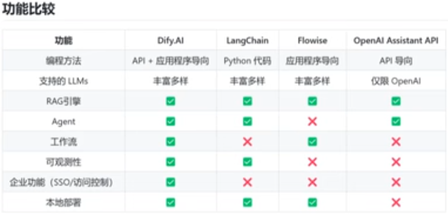

<p align="center">
  <a href="" rel="noopener">
 </a>
</p>

<h3 align="center">MyAIAssistant</h3>

<div align="center">

[]()
[](https://github.com/JevenM/MyAIAssistant/issues)
[](https://github.com/JevenM/MyAIAssistant/pulls)
[](/LICENSE)

</div>

---

<p align="center"> 使用langchain + streamlit + chromadb + langchain_community + langchain_core + m3e-base，实现一个聊天机器人和基于RAG的智能文档检索工具，使用的AI模型是阿里云百炼通义大模型。还有一个记账本功能。主要是基于慕课网的课程、Bilibili 的教程还有GitHub的代码。
    <br> 
</p>


## 📝 目录 / Table of Contents

- [项目简介 About](#about)
- [功能 Features](#features)
- [目录结构 Structure](#structure)
- [快速开始 Getting Started](#getting_started)
- [依赖 Dependencies](#dependencies)
- [用法 Usage](#usage)
- [贡献 Contributing](#contributing)
- [作者 Authors](#authors)
- [致谢 Acknowledgements](#acknowledgement)


## 🧐 项目简介 About <a name = "about"></a>

MyAIAssistant 是一个基于 Streamlit、LangChain、ChromaDB、阿里云通义大模型的智能助手，集成了聊天机器人、RAG 本地知识库检索、记账本等功能，适合个人和开发者扩展。支持 LangGraph 实现大模型循环计算与复杂任务流程。

---


## ✨ 功能 Features <a name="features"></a>

- 聊天机器人（支持联网问答）
- RAG 本地知识库检索
- 记账本与统计分析
- 用户登录注册
- 多页面支持，便于扩展

---


## 📁 目录结构 Structure <a name="structure"></a>

```text
MyAIAssistant/
├── app.py                # 主入口
├── requirements.txt      # Python依赖
├── environment.txt       # Conda环境依赖
├── README.md             # 项目说明
├── users.json            # 用户数据
├── manage_account.py     # 账户管理
├── login.py              # 登录注册
├── learn.py              # 学习/测试页
├── trial.py              # 试用页
├── chroma_db/            # 向量数据库
├── pages/                # Streamlit多页面
├── .streamlit/           # Streamlit配置
├── .devcontainer/        # Dev容器配置
├── images/               # 项目图片
└── __pycache__/          # Python缓存
```

---


## 📦 依赖 Dependencies <a name="dependencies"></a>

核心依赖：streamlit、langchain、chromadb、langchain_community、langchain_core、pandas、Pillow、pydantic。详见 requirements.txt 和 environment.txt。

---


## 🚀 快速开始 Getting Started <a name="getting_started"></a>

1. 安装依赖
   ```shell
   pip install -r requirements.txt
   # 或使用 conda
   conda create --name env --file environment.txt
   conda activate env
   ```
2. 启动服务
   ```shell
   streamlit run app.py
   ```
3. 停止服务 Stop Streamlit app
    ```shell
    taskkill /F /IM streamlit.exe 2>/dev/null || pkill -f streamlit 2>/dev/null || echo "Streamlit stopped"

    或者
    netstat -ano | grep -E ":(8501|8502|8503|8504|8505)" | grep LISTENING
    ```

---


## 🎈 用法 Usage <a name="usage"></a>

1. 登录或注册账号
2. 选择页面体验聊天、知识检索、记账等功能
3. 可扩展 pages/ 下的页面，实现更多功能

---


## 🛠️ 贡献 Contributing <a name="contributing"></a>

欢迎提交 issue、pull request 或新功能建议！

---


---

## ✍️ Authors <a name = "authors"></a>

- [@antrn](https://github.com/antrn) - Idea & Initial work

## 🎉 Acknowledgements <a name = "acknowledgement"></a>

- Hat tip to anyone whose code was used
- Inspiration
- References

### Dify
[基于Dify构建AI原生应用](https://www.bilibili.com/video/BV1BgfBYoEpQ?spm_id_from=333.788.player.switch&vd_source=931b05f7be003850061ee95a1f978f8d&p=13)



