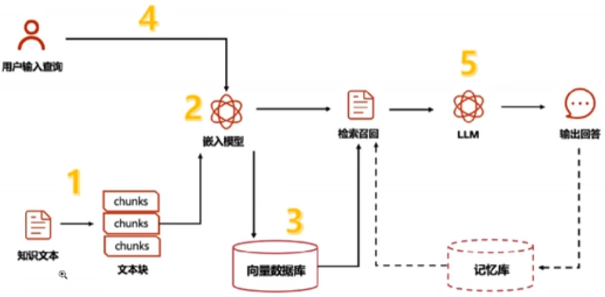
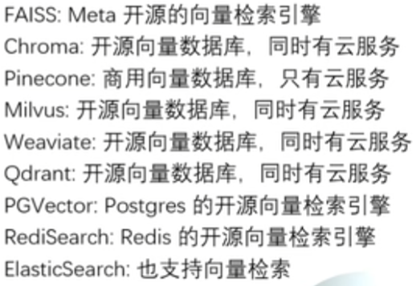
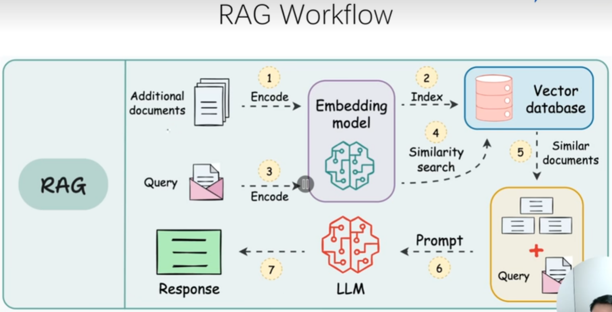

<p align="center">
  <a href="" rel="noopener">
 </a>
</p>

<h3 align="center">Project Title</h3>

<div align="center">

[]()
[](https://github.com/JevenM/MyAIAssistant/issues)
[](https://github.com/JevenM/MyAIAssistant/pulls)
[](/LICENSE)

</div>

---

<p align="center"> 使用langchain + streamlit + chromadb + langchain_community + langchain_core + m3e-base，实现一个聊天机器人和基于RAG的智能文档检索工具，使用的AI模型是阿里云百炼通义大模型。还有一个记账本功能。主要是基于慕课网的课程、Bilibili 的教程还有GitHub的代码。.
    <br> 
</p>

## 📝 Table of Contents

- [About](#about)
- [Getting Started](#getting_started)
- [Deployment](#deployment)
- [Usage](#usage)
- [Built Using](#built_using)
- [TODO](../TODO.md)
- [Contributing](../CONTRIBUTING.md)
- [Authors](#authors)
- [Acknowledgments](#acknowledgement)

## 🧐 About <a name = "about"></a>

Write about 1-2 paragraphs describing the purpose of your project.

新增LangGraph，是LangChain的高级库，为大语言模型带来循环计算能力，超越了LangChain的现行工作流，通过循环支持复杂的任务流程。

### 支持功能

#### 聊天记录

#### 聊天问答（可选联网）

#### 基于RAG本地知识库问答


#### 记账本

#### 登录注册


## 🏁 Getting Started <a name = "getting_started"></a>

These instructions will get you a copy of the project up and running on your local machine for development and testing purposes. See [deployment](#deployment) for notes on how to deploy the project on a live system.

### Prerequisites

#### 生成依赖包列表
1. 安装pipreqs
为了使用pipreqs生成最小化的requirements.txt文件，首先需要在你的环境中安装这个工具。只需一行命令，即可轻松完成安装：
```shell
pip install pipreqs
```
确保安装完成后，你就可以开始使用pipreqs来精简你的项目依赖了。

2. 运行pipreqs
在项目的根目录下，运行以下命令以生成requirements.txt文件：
```shell
pipreqs ./ --encoding=utf8 --force
```
这个命令会扫描你的代码文件，并仅生成项目实际所需的依赖包，排除conda base中的不相关包。生成的requirements.txt文件将干净、精简，与你在项目中手动引用的包完全一致。

注意：pipreqs通过扫描代码来确定项目依赖，因此它更侧重于“按需打包”。如果代码中没有直接导入的包，pipreqs可能无法识别（例如，通过插件或间接依赖安装的包）。

### Installing

A step by step series of examples that tell you how to get a development env running.

Say what the step will be

```
Give the example
```

And repeat

```
until finished
```

End with an example of getting some data out of the system or using it for a little demo.

#### 启动
```shell
streamlit run app.py
```

## 🔧 Running the tests <a name = "tests"></a>

Explain how to run the automated tests for this system.

### Break down into end to end tests

Explain what these tests test and why

```
Give an example
```

### And coding style tests

Explain what these tests test and why

```
Give an example
```

## 🎈 Usage <a name="usage"></a>

Add notes about how to use the system.

## 🚀 Deployment <a name = "deployment"></a>

Add additional notes about how to deploy this on a live system.

## ⛏️ Built Using <a name = "built_using"></a>

- [MongoDB](https://www.mongodb.com/) - Database
- [Express](https://expressjs.com/) - Server Framework
- [VueJs](https://vuejs.org/) - Web Framework
- [NodeJs](https://nodejs.org/en/) - Server Environment

## ✍️ Authors <a name = "authors"></a>

- [@kylelobo](https://github.com/kylelobo) - Idea & Initial work

See also the list of [contributors](https://github.com/kylelobo/The-Documentation-Compendium/contributors) who participated in this project.

## 🎉 Acknowledgements <a name = "acknowledgement"></a>

- Hat tip to anyone whose code was used
- Inspiration
- References


### Dify
[基于Dify构建AI原生应用](https://www.bilibili.com/video/BV1BgfBYoEpQ?spm_id_from=333.788.player.switch&vd_source=931b05f7be003850061ee95a1f978f8d&p=13)




